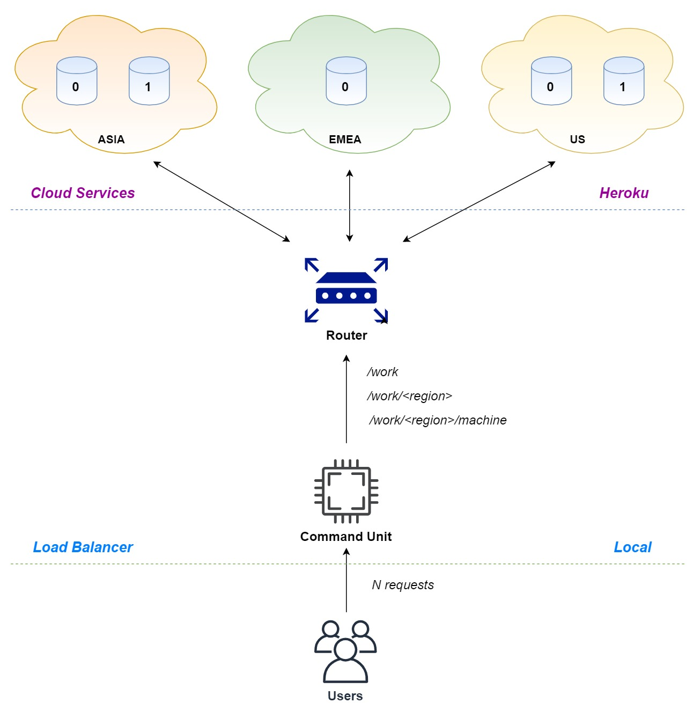

# Load Balancer - Performance Evaluation - assignment

## Context
In the last years, the number of Internet users has seen an unprecedented growth. Whether these users are human beings or machines (IoT devices, bots, other services, mobile clients etc.) they place a great burden on the systems they are requesting services from. As a consequence, the administrators of those systems had to adapt and come up with solutions for efficiently handling the increasing traffic. In this assignment, we will focus on one of them and that is **load balancing**.

A **load balancer** is a proxy meant to distribute traffic across a number of servers, usually called **services**. By adding a load balancer in a distributed system, the **capacity** and **reliability** of those services greatly increase. That is why in almost every modern **cloud architecture** there is at least one layer of load balancing.
## Architecture
We propose a **cloud system** that acts as a global service, replicated across multiple **machines/workers** and **regions**, which must serve the clients as efficiently as possible. Supposing that all the requests are coming from users found in the same country, the **latencies** expected from the cloud regions differ. Moreover, the **number of machines** available on each region vary and all these aspects can have an impact on the overall performance of the system.

That is why, a dedicated proxy that decides where to route those requests coming from the clients had to be added into the system. Obviously, this proxy is our **load balancer** and in this particular scenario it is divided into **2 main components**:
1. A **router**, meant to **forward the requests** coming from the clients to an actual machine available on a certain region
1. A **command unit** that is supposed to **identify the number of requests** that are about to hit our system and decide, based on this number, how to **efficiently utilize the routing unit**
You can have an overview on the proposed architecture by looking at the diagram below:

In this assignment, you will be focusing on the **Command Unit**, the other components of the system being already implemented by us and deployed in **Docker images**.

For simplicity, the **routing unit** is also exposing a **REST API** through which the **command unit** can choose what machine and region the request should be forwarded to. The available **endpoints** are:
* **/work** - forwards the request to a random machine from a random region
* **/work/<string:region>** - forwards the request to a random machine from the specified region
* **/work/<string:region>/<int:machine>** - forwards the request to a specific machine from a specific region

In our system, each **worker** is placed in a separate **Docker image**, which can be easily used as-is and deployed locally or on a cloud service. The same happens with the **forwarding unit**, also called **master**.

In order to simulate a real-world environment in which the **requested services** cannot be found locally, we chose to host the workers on a **cloud platform as a service (PaaS) provider**. Due to its attractive pricing (it's free), we chose Heroku.

## Implementation
You have to implement the **command unit** component of the **load balancer** in **Python 3** and deploy it locally. Having a number of requests **N** as input, try various strategies of calling the **3 endpoints** available on the **forwarding unit** so that your clients experiment response times as low as possible. There are no constraints applied to how you read the number of requests, what Python library you use to call the forwarding unit or how you plot the results.
